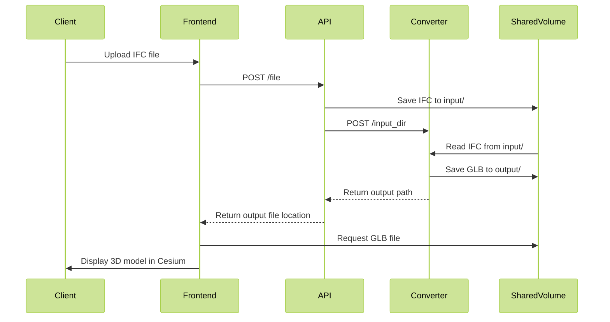

```mermaid
%%{init: {'theme':'forest'}}%%
sequenceDiagram
    participant Client
    participant Frontend
    participant API
    participant Converter
    participant SharedVolume

    Client->>Frontend: Upload IFC file
    Frontend->>API: POST /file
    API->>SharedVolume: Save IFC to input/
    API->>Converter: POST /input_dir
    SharedVolume->>Converter: Read IFC from input/
    Converter->>SharedVolume: Save GLB to output/
    Converter-->>API: Return output path
    API-->>Frontend: Return output file location
    Frontend->>SharedVolume: Request GLB file
    Frontend->>Client: Display 3D model in Cesium
```